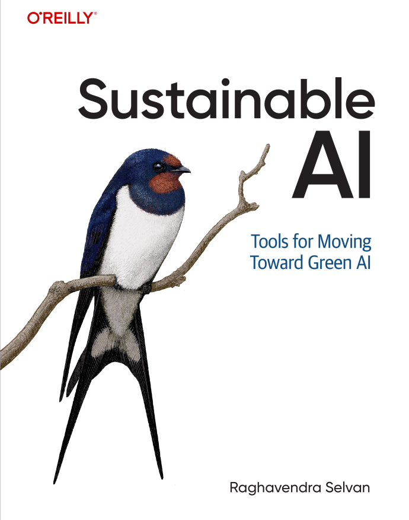

# Official Repository for the book "Sustainable AI" by Raghavendra Selvan (O'Reilly, 2025)

# Table of Contents

1. [Preface to the book](#preface)
2. [Exercises](#exercises)
3. [List of References](#list-of-references)
4. [Additional Material](#additional-material)

## Preface

Climate change is at our door step. It is causing heat waves, flash floods, droughts, and other erratic weather patterns. Addressing the challenges posed by climate change will be the defining project of our times. To do this, we should employ all the tools at our disposal. And one of the most powerful tools currently is artificial intelligence (AI), which has revolutionized tasks in many application domains. As such, AI can be indispensable in our efforts to combat climate change. 

The recent class of AI methods, however, is growing to be extremely resource-intensive. Developing and using them requires powerful datacenters, which consume vast amounts of energy with correspondingly high carbon emissions. In addition, the datacenters used for AI require large volumes of fresh water in their cooling systems, rely on extractive mining to manufacture the electronics, and incur additional carbon emissions along their lifecycle. These factors, and other broader environmental impacts, pose a dilemma about using AI for sustainability.

The main argument in this book is that the material basis for any technology should not be discounted even in the light of their promised benefits. This is also true for AI. Even though AI has promised—and delivered on some—solutions to the sustainability challenges, the underlying resource cost of AI should not be ignored. If we don't pay close attention to these massive costs, the supposed benefits offered might be eclipsed by the negative impacts of AI; the trade-off between the cost and benefits should always be considered. 

This book is an attempt to lay out these arguments so that we can make meaningful trade-offs that advance the sustainability of AI, while using it to improve the sustainability of our planet. To do this, the book presents practical tools and conceptual frameworks that will help us assess and grapple with the complex interplay between sustainability and AI.

## [Exercises](files/exercises.md)

The book provides small worked examples along with the text. These are not complete by themselves as I have omitted package loading, book keeping, and other standard code. The complete code to run each of the examples, along with additional context, is provided [here](files/exercises.md).

## [List of References](files/references.md)

The book uses footnote-style referencing, and there is no single bibliography list in the book. The complete list of references, and additional reading material per chapter is provided [here](files/references.md).

## [Additional Material](files/additional.md)

## [Reproducibility](files/reproducibility.md)
